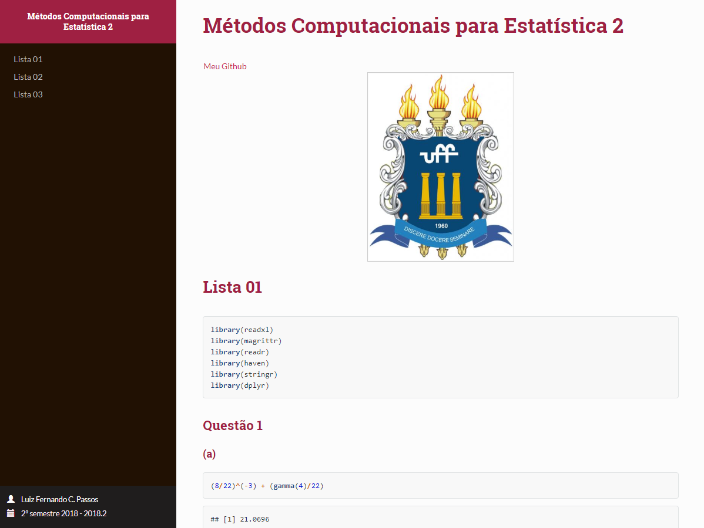

## Métodos Computacionais para Estatística II - UFF 

Essas foram as listas que eu fiz enquanto curso a disciplina Métodos Computacionais para Estatística II na Universidade Federal Fluminense, as aulas são ministradas pelo Prof. Dr. Jony Arrais. 
Sinta-se a vontade para corrigir as listas caso encontre algum erro ou até mesmo otimizar alguns códigos. 

--- 

**ATENÇÃO!** AS LISTAS NÃO FORAM CORRIGIDAS PELO PROFESSOR, LOGO PODEM SER ENCONTRADOS ALGUNS ERROS.  

---

**HTML contendo todas as listas feitas enquanto curso a disciplina**

<a href="http://rpubs.com/luizfcp/lista-metodos">

</a>

---

Repositório inspirado em [Daniel dos Santos](https://github.com/Daniel-EST/metodos-listas-uff)
